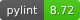

<div align="center">
	
    <h1 style="font-size: large; font-weight: bold;">TDAAD</h1>
</div>

<div align="center">
    <a href="#">
        
    </a>
    <a href="#">
        
    </a>
    <a href="#">
        
    </a>
    <a href="_static/pylint/pylint.txt">
        
    </a>
    <a href="_static/flake8/index.html">
        
    </a>
	<a href="_static/coverage/index.html">
        
    </a>
</div>
<br>


<div align="center">
    <a href="https://github.com/IRT-SystemX/tdaad">
        
    </a>
    <a href="https://irt-systemx.github.io/tdaad/">
        
    </a>
    <a href="https://pypi.org/project/tdaad/">
        
    </a>
</div>
<br>


---
# TDAAD – Topological Data Analysis for Anomaly Detection

## Overview

TDAAD is a Python package for unsupervised anomaly detection in multivariate time series using Topological Data Analysis (TDA). Website and documentation: https://irt-systemx.github.io/tdaad/

It builds upon two powerful open-source libraries:

- [](https://gudhi.inria.fr/) **[GUDHI](https://gudhi.inria.fr/)** for efficient and scalable computation of persistent homology and topological features,
- [](https://scikit-learn.org/) **[scikit-learn](https://scikit-learn.org/)** for core machine learning utilities like `Pipeline` and objects like `EllipticEnvelope`.

TDAAD is inspired by the methodology introduced in:

> **Chazal, F., Levrard, C., & Royer, M. (2024).** *Topological Analysis for Detecting Anomalies (TADA) in dependent sequences: application to Time Series*. Journal of Machine Learning Research, 25(365), 1–49. [https://www.jmlr.org/papers/v25/24-0853.html](https://www.jmlr.org/papers/v25/24-0853.html)


## 🔍 Features

- Unsupervised anomaly detection in multivariate time series
- Topological embedding using persistent homology
- Scikit-learn–style API (`fit`, `transform`, `score_samples`)
- Configurable embedding dimension, window size, and topological parameters
- Works with NumPy arrays or pandas DataFrames


## 🛠 Installation

Install from PyPI (recommended):

```bash
pip install tdaad
```
Or install from source:
```bash
git clone https://github.com/IRT-SystemX/tdaad.git
cd tdaad
pip install .
```
Requirements:
- Python ≥ 3.7
- See `requirements.txt` for full dependency list

## 🚀 Quickstart

Here’s a minimal example using `TopologicalAnomalyDetector`:
```python
import numpy as np
from tdaad.anomaly_detectors import TopologicalAnomalyDetector

# Example multivariate time series with shape (n_samples, n_features)
X = np.random.randn(1000, 3)

# Initialize and fit the detector
detector = TopologicalAnomalyDetector(window_size=100, n_centers_by_dim=3)
detector.fit(X)

# Compute anomaly scores
scores = detector.score_samples(X)
```
You can also use `pandas.DataFrame` instead of a NumPy array — column names will be preserved in the output.

For more advanced usage (e.g. custom embeddings, parameter tuning), see the [examples folder](examples/) or [API documentation](https://irt-systemx.github.io/tdaad/)


## 📌 Usage Notes

- TDAAD is designed for **multivariate time series** (2D inputs) — univariate data is not supported.
- The core detection method relies on **sliding-window embeddings** and **persistent homology** to identify structural changes in the signal.
- The key parameters that impact results and runtime are:
    - `window_size` controls the time resolution — larger windows capture slower anomalies, smaller ones detect more localized changes.
    - `n_centers_by_dim` controls the number of reference shapes used per homology dimension (e.g. connected components in H0, loops in H1, ...). Increasing this improves sensitivity but adds computation time.
    - `tda_max_dim` sets the **maximum topological feature dimension** computed (0 = connected components, 1 = loops, 2 = voids, ...). Higher values increase runtime and memory usage.
- Internally, computations are **parallelized** using `joblib` to scale to larger datasets. Use `n_jobs` to control parallelism.
- Inputs can be `numpy.ndarray` or `pandas.DataFrame`. Column names are preserved in the output when using DataFrames.

⚙️ You can typically handle ~100 sensors and a few hundred time steps per window on a modern machine.

### 🧮 Basic Complexity of Persistent Homology in TDAAD

- Total complexity scales with:  $`O(N × (w × p)^{(d+2)})`$ where $`w`$ is the time resolution (or `window_size`, number of time steps per window), $`p`$ is the number of variables (features/sensors), $`d`$ is the maximum homology dimension `tda_max_dim`, and $`N`$ is the total number of sliding windows.
- So note that increasing max homology dimension `d` raises the exponent, causing exponential growth. The number of centers `n_centers_by_dim` used after the PH computation does not significantly affect the overall complexity.


## 📚 Documentation & Resources

- [📖 Full API Documentation](https://irt-systemx.github.io/tdaad/)
- [🧪 Examples](examples/)
- [🛠 Contributing Guide](CONTRIBUTING.md)
- [🗒 Changelog](CHANGELOG.md)

---

## Document generation

To regenerate the documentation, rerun the following commands from the project root, adapting if
necessary:

```
pip install -r docs/docs_requirements.txt -r requirements.txt
sphinx-apidoc -o docs/source/generated tdaad
sphinx-build -M html docs/source docs/build -W --keep-going
```

## Contributors and Support

This work has been supported by the French government under the "France 2030” program, as part of the SystemX Technological Research Institute within the **Confiance.ai** project. 

<p align="center">
  TDAAD is developed by
  <a href="https://www.irt-systemx.fr/en/" title="IRT SystemX">
   
  </a>and supported by the
<a href="https://www.trustworthy-ai-foundation.eu/" title="European Trustworthy AI association">

</a>
</p>
